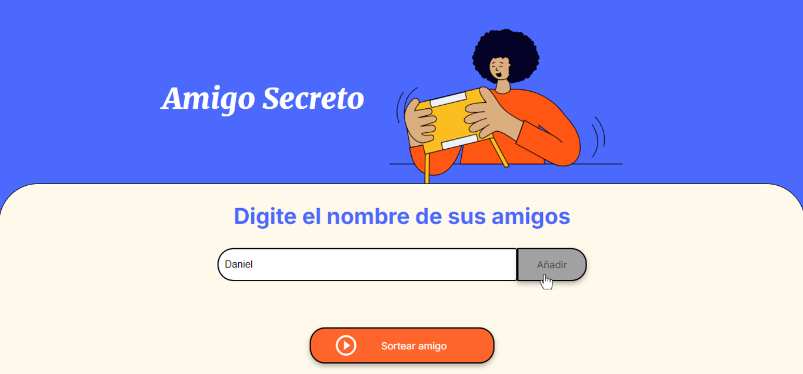

# Amigo Secreto

Este proyecto consiste en una aplicación interactiva que permite a los usuarios gestionar una lista de nombres de amigos y realizar un sorteo aleatorio para determinar quién será el "amigo secreto". El objetivo principal es fortalecer habilidades en lógica de programación mientras se crea una experiencia sencilla y funcional.

## Funcionalidades

- **Agregar nombres:** Los usuarios pueden escribir el nombre de un amigo en un campo de texto y agregarlo a una lista visible haciendo clic en el botón "Añadir".
- **Validar entrada:** Si el campo de texto está vacío, el programa mostrará una alerta solicitando un nombre válido.
- **Visualizar la lista:** Los nombres ingresados aparecerán en una lista debajo del campo de entrada.
- **Sorteo aleatorio:** Al hacer clic en el botón "Sortear Amigo", se seleccionará de forma aleatoria un nombre de la lista y se mostrará el resultado en pantalla.

## Tecnologías Utilizadas

- **HTML:** Para la estructura del proyecto.
- **CSS:** Para el diseño visual.
- **JavaScript:** Para la lógica interactiva del proyecto.

## Instalación y Uso

1. **Clonar el repositorio:**

   ```bash
   git clone https://github.com/dano796/challenge-amigo-secreto.git
   cd challenge-amigo-secreto
   ```

2. **Abrir el proyecto:**
   - Abre el archivo `index.html` en tu navegador.

3. **Interacción con la aplicación:**
   - Escribe un nombre en el campo de texto y haz clic en "Añadir" para agregarlo a la lista.
   
   - Haz clic en "Sortear Amigo" para seleccionar aleatoriamente un nombre de la lista.
   

## Estructura del Proyecto

- `index.html`: Contiene la estructura principal de la página.
- `styles.css`: Define los estilos visuales.
- `script.js`: Contiene toda la lógica de programación, incluyendo validación, gestión de la lista y sorteo.

## Ejemplo de Código

```javascript
// Función para agregar un amigo
function agregarAmigo() {
    let nombre = document.getElementById('amigo').value;
    if (validarEntrada(nombre)) {
        amigos.push(nombre);
        document.getElementById('amigo').value = '';
        actualizarLista();
    }
}
```

---

Practicando Lógica de Programación: Challenge Amigo Secreto
Challenge de la Formación Principianre en Programación G8-ONE
Daniel Ortiz Aristizábal
